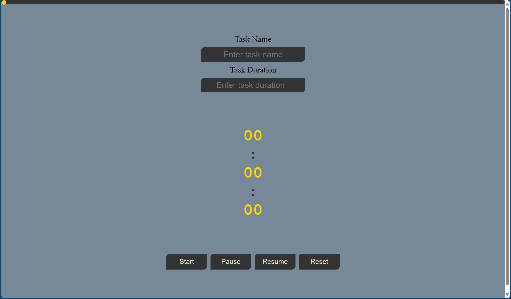
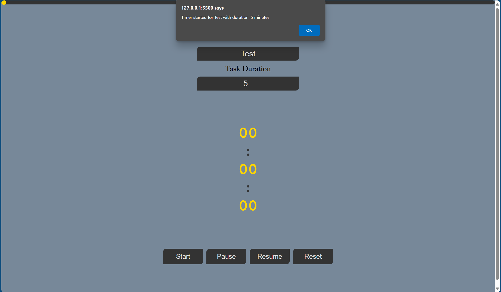
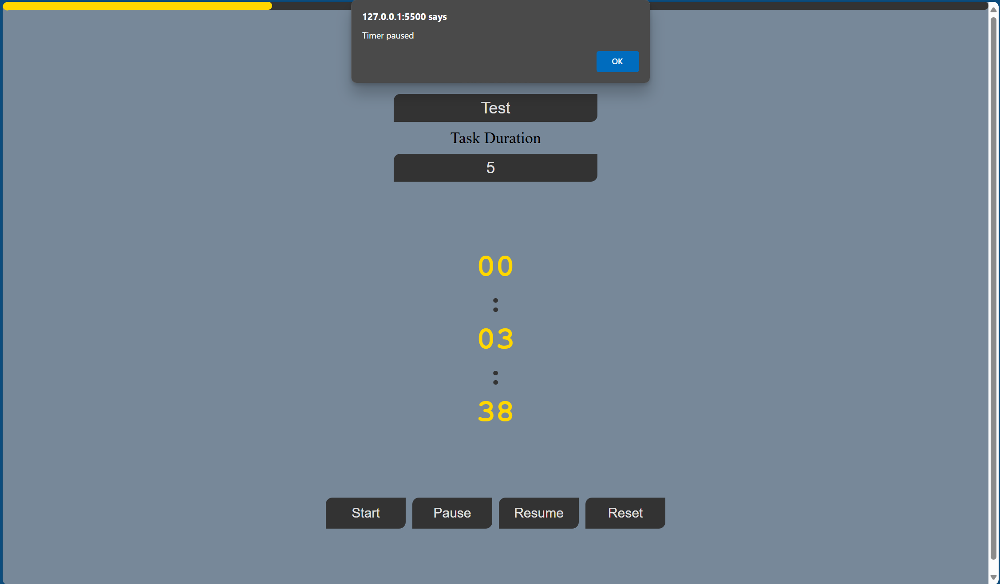

# Interactive Timer Project

## Description

An interactive countdown timer web application that features a customizable timer with a visual progress bar. Users can start, pause, and reset the timer, with a smooth horizontal progress bar indicating the elapsed time.

## Features

- Customizable countdown timer
- Start, pause, and reset functionality
- Visual progress bar showing elapsed time
- Smooth animations and transitions

## Technologies Used

- HTML5
- CSS3 (with animations and transitions)
- JavaScript (vanilla)
- BEM methodology for CSS organization

## Project Preview

## How to Use

1. Open the timer in your web browser
2. Set your desired time using the input field
3. Click "Start" to begin the countdown
4. Use "Pause" to temporarily stop the timer
5. Click "Reset" to clear the timer

## Future Improvements

- Add sound notifications when timer completes
- Save timer presets
- Add multiple concurrent timers
- Dark/light theme toggle

## GitHub Pages

[Add your GitHub Pages link here once deployed]
